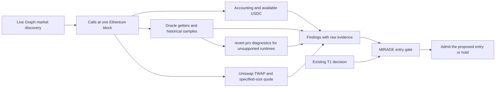

# MIRAGE — evidence before allocation

MIRAGE checks a Morpho Blue market before this repository's existing USDC
allocator enters it. It separates accounting claims from available liquidity,
examines the configured oracle, and asks Uniswap whether a specified collateral
sale can be quoted within an explicit policy. The result is an admission decision
with the exact contract calls behind it.

Built for **ETHOnline 2026, Continuity Track** (selected in the event dashboard), using the existing allocator and
[revert.pro](https://github.com/SergeySolovyev/icicpe-2026-defi-vuln-detection).
The product includes an interactive workbench, an MCP interface for agents,
live Ethereum reads, a deployed Graph subgraph, an actual Uniswap v3 integration,
and reproducible saved evidence.

## Run the workbench

Use Python 3.11+; development validation uses Python 3.12. From the repository root:

```console
python -m pip install -r requirements-mirage.txt
python -m mirage serve
```

Open [http://127.0.0.1:8765](http://127.0.0.1:8765). No wallet, deploy key,
Node build, or model weights are needed to run the workbench.

1. Inspect the saved market ledger. The source label and Ethereum block identify
   the evidence being shown; opening the application does not perform a live scan.
2. Open a market to see its separate findings and copy its raw call evidence.
3. Select a destination and proposed USDC amount, then **Preview allocation** to
   compare the original T1 decision with the MIRAGE gate at the evidence block.
4. **Check market** requests fresh Graph discovery and chain observations for the
   selected market and amount. Changing the amount requires a matching exit quote;
   an old quote cannot grant admission for the new scenario.
5. Use **Check another market**, paste a full Morpho market ID, and press
   **Check ID** to inspect a market beyond the saved shortlist. The Graph must
   confirm it is a USDC market at the selected block before collection proceeds.
6. **Load demo** restores the four committed cases and their saved-evidence label.

[Open the public workbench](https://mirage-workbench.onrender.com).
The Render deployment was checked through a browser on 9 September, including
fresh Graph discovery, a WETH inspection and its allocation preview. Its address
survives local computer shutdown. The free instance sleeps when idle, so the
first request after a pause can take about a minute.
See [hosting details](docs/mirage/HOSTING.md) and the
[public browser check](docs/mirage/RENDER_BROWSER_VERIFICATION_2026-09-09.json).

The server binds to localhost. A failed refresh leaves the saved evidence visible
and reports the failure. It does not relabel saved evidence as a successful live
check. The default demo is selected by [`mirage/snapshots/demo.json`](mirage/snapshots/demo.json).

## BEFORE — the two existing foundations

The allocator's baseline is
[`520b676`](https://github.com/SergeySolovyev/icicpe-2026-event-time-mcdm-defi/commit/520b676),
before the first hackathon commit `e56cd7f` on 9 September 2026. It already
contained an event-time USDC allocator for Aave V3, Compound V3, Spark, Morpho
Blue, Euler V2 and Fluid:

- [T1](decision/t1_threshold.py) compares APR, estimated holding time, capital and
  switching costs. [T2](decision/t2_optimal_stopping.py) uses optimal stopping;
  [T3](decision/t3_hazard.py) uses a survival model, with fallback to T1.
- [EventReplayEngine](backtest/replay_per_block.py) handles per-block yield and gas
  around the existing [DecisionPolicy interface](decision/base.py).
- The [reproduction notebook](notebooks/reproduce_predictive_mcdm_defi.ipynb) and
  research results predate MIRAGE and are not claimed as hackathon results.

T1/T2/T3 do **not** rank by TVL. Their existing `morpho_blue` label names one
wstETH/USDC market. MIRAGE preserves that mapping and uses explicit market IDs
in its new demonstration; it does not rename PAXG into the old venue or claim
that substituting TVL changes the old policy's decisions.

The second foundation is revert.pro's EVM bytecode feature extractor. MIRAGE
vendors the **unmodified MIT source** from commit
`324431a514c5ebebbdbe620cb789f83ea78a231a` and directly calls its
`_extract_features_single` method. [Source, license and exact-byte provenance](mirage/vendor/revert_pro/PROVENANCE.md)
are included in the repository. The reused code extracts structural features;
no learned vulnerability model or security score drives admission.

## AFTER — the MIRAGE contribution



| Component | Implemented behavior |
|---|---|
| [The Graph subgraph](subgraph/) and [discovery client](mirage/discovery/subgraph.py) | Discover USDC market IDs from `CreateMarket`, paginate at a fixed block hash, verify deployment and indexing status |
| [Accounting check](mirage/detectors/phantom_volume.py) | Read stored supply/borrow state, calculate available USDC, utilization and the normalized share rate |
| [Oracle reader](mirage/chain/oracle.py) and [detector](mirage/detectors/frozen_price.py) | Check code existence, official V2 factory membership, all nine configuration getters, historical prices and feed update observations |
| [revert.pro adapter](mirage/bytecode.py) | Invoke the original 70-feature extractor on unsupported runtimes; expose structural diagnostics and new PUSH operand candidates |
| [Uniswap collector](mirage/chain/uniswap.py#L136) | Find canonical v3 pools, read geometric TWAPs and compare direct/WETH QuoterV2 routes for the same collateral input |
| [Reference policy](mirage/detectors/reference_price.py) and [exit policy](mirage/detectors/exit_depth.py) | Compare oracle/reference prices and quoted execution against explicit deviation thresholds |
| [Snapshots and reports](mirage/scan.py) | Rebuild derived oracle, reference, rate and policy values from raw saved responses; reject inconsistent observations |
| [Entry gate](mirage/gate.py) and [decision comparison](mirage/allocator.py) | Run the existing T1 policy, then veto an entry that lacks acceptable, matching evidence |
| [Local server](mirage/server.py) and [workbench](mirage/web/) | Inspect findings, copy evidence, check a live market and compare actual policy responses |

The gate calls the original policy **once on the complete state**. By default it
vetoes `block` and `insufficient`, requires the same decision block, and rejects
future reports. It does not force liquidation of an existing position, rerank
the candidates, or select an alternative destination. Unmapped venues are
explicitly outside its coverage.

See [the architecture and local API](docs/mirage/ARCHITECTURE.md) for the complete
data path and the boundary between collected evidence, replay and policy.

## AI use and planning provenance

Sergey supplied the two existing repositories, the product direction and the
initial research context. OpenAI Codex agents generated and revised most of the
new MIRAGE implementation, tests, interface and documentation. Earlier Claude
Code assistance is reported in the supplied preparation history. See the
[file-level AI disclosure](docs/mirage/AI_USE.md),
[corrected build specification](docs/mirage/planning/BUILD_SPEC.md) and
[prompt provenance](docs/mirage/planning/PROMPT_PROVENANCE.md).
These documents identify the observed contributions and unresolved historical
attribution; they are not a complete original prompt archive.

## What the demo proves

The Graph discovery at block **25,938,082** returned **697 USDC market IDs**.
The [frozen demo](mirage/snapshots/mainnet-full-25938082-routes-v2.json.gz) inspects **four**
markets from that discovery universe for a hypothetical **10,000 USDC** sale.
**697 discovered does not mean 697 assessed.** Both discovery and inspected
counts remain in the report's source metadata.

| Saved case | Result at this block and scenario |
|---|---|
| PAXG/USDC | Block: zero pre-existing available USDC and oracle/reference divergence |
| deUSD/USDC | Insufficient: constant oracle configuration observed, supported reference/exit route unavailable |
| wstETH/USDC | Insufficient: exit quote passes through WETH; the legacy oracle template remains unsupported |
| WETH/USDC | Pass: accounting, supported oracle/reference and specified-size quote satisfy the configured checks |

A pass applies only to these checks at this block and scenario; future execution
can differ. The block hash is
`0x7647a0738f03a46dd0c957cca4664d73f9bcc7c981405a8ccb00e3bd08ede2cb`.

The route comparison is material: for the same **3.220832145173417247 wstETH**,
the direct quote returns **5,927.556111 USDC**, while the WETH route returns
**10,007.772538 USDC**, with approximately **6.39 bps** impact against that
route's spot price. The independent reference remains the original direct-pool
TWAP, approximately **3,104.787691 USDC per wstETH**. Changing the exit route does
not change the reference or the input size to improve the result.

The evidence-block comparison makes the original T1 policy propose PAXG/USDC,
then shows the MIRAGE gate hold because the destination fails its admission
checks. PAXG has zero pre-existing available USDC at that block. This demonstrates
a changed entry decision, not historical loss prevention or a completed trade.

The decision input is an **annualized IRM accrual-rate indication** computed
from `borrowRateView` on the stored market tuple. For AdaptiveCurveIrm, the return
is the interval-average borrow rate since `lastUpdate`; it is not an
instantaneous rate or a promise of future yield. MIRAGE preserves the interval
and timestamp in the [rate evidence](mirage/chain/rates.py).

This is a cold-start comparison on the explicitly inspected markets, with no
existing position and zero switching cost in that initial decision. It is not
a historical six-protocol backtest. The entered USDC amount also declares a
hypothetical collateral-sale notional at the observed TWAP; it is not a measured
borrower position, total liquidation demand, or guaranteed recovery amount.

## Honest interpretation of the checks

**Accounting.** `totalSupplyAssets` records accounting claims, not unborrowed
USDC. Available liquidity is `totalSupplyAssets - totalBorrowAssets`; it is not
a guarantee of an individual account's withdrawal rights. The exact share rate
relative to its initial value is:

```text
1e6 * (totalSupplyAssets + 1) / (totalSupplyShares + 1e6)
```

`totalSupplyShares / 1e6` is **not recovered principal**. A high share rate is a
warning, not proof of phantom borrowing or insolvency. The historical filename
`phantom_volume.py` does not change that interpretation. See the
[accounting corrections](docs/mirage/CORRECTIONS_2026-09-09.md).

**Oracle behavior.** Two equal price samples do not prove a frozen interval. For
the supported MorphoChainlinkOracleV2 template, six zero feed/vault addresses and
a price equal to its scale establish a constant configuration. That is a warning
until independently corroborated; a nominal price can be correct for identical
assets. Missing code, malformed returns, unknown templates and incomplete
observations remain `insufficient`. PUSH operands are candidates, not recovered
immutables or proven dependencies. The legacy wstETH oracle in the old allocator
is currently outside the supported V2 template.

**Uniswap.** The implemented reference uses a 30-minute geometric TWAP. It searches
four direct v3 fee tiers, then uses a WETH reference if no direct pool is usable.
For the specified sale it compares the usable direct and WETH routes for the
same collateral input and selects the greater quoted USDC output. It uses one
unsplit route, including pool fees and excluding gas; it does not search every
possible execution path. The default policy threshold is 500 bps for oracle divergence
and for execution shortfall. These are configurable Python policy parameters,
not protocol safety guarantees. A failed or unavailable quote means insufficient
evidence, not zero global liquidity. [Integration details and verified mainnet example](docs/mirage/UNISWAP.md)
and [developer feedback](FEEDBACK.md) document the actual implementation.

## Live Graph and command line

The deployed Studio version is `v0.0.1`, deployment
`QmYkbwLirDouGqfRapedCcQ8YCbM8dzKA13agskDwGzJ6K`.
A live Graph-to-report run completed for the inspected shortlist. The indexer
had reached block 25,938,167 when the evidence block was queried. Unsupported
data stays visible in individual findings.

The workbench already uses the query endpoint. For the CLI, configure it explicitly:

```powershell
$env:MIRAGE_SUBGRAPH_URL = 'https://api.studio.thegraph.com/query/1759002/mirage-morpho-markets/v0.0.1'
python -m mirage scan --source=subgraph --full --amount 10000
```

This command attempts full checks for **every discovered market** and can be
slow on public RPCs. Its output is `mirage/feed/latest.json`. Omitting `--full`
requests accounting-only coverage and leaves the remaining checks insufficient.
The subgraph contains discovery data only; monetary state comes from Ethereum
contract calls. Graph failure has no silent Morpho API or snapshot fallback.

Other commands:

```console
python -m mirage demo --offline
python -m mirage verify 0x8eaf7b29f02ba8d8c1d7aeb587403dcb16e2e943e4e2f5f94b0963c2386406c9 --full --amount 10000 --snapshot data/cached/mirage/my-market.json.gz
python -m mirage serve --port 8766 --snapshot data/cached/mirage/my-market.json.gz
```

`verify` is an explicit-market RPC capture, so it does not claim live Graph use.
The default live anchor is Ethereum's `finalized` block; `--block` can select a
numeric block. Saved snapshots refuse overwrites. [`demo.json`](mirage/snapshots/demo.json)
selects the committed default; older accounting-only snapshots remain reproducible.
The earlier [`mainnet-full-25938082.json.gz`](mirage/snapshots/mainnet-full-25938082.json.gz)
is retained as a regression artifact for the superseded direct-first routing
policy, not as the current wstETH exit assessment.
Configure comma-separated `MIRAGE_RPC_URLS` for your own RPC providers, or pass
`--graph-url` to `serve` for another compatible Graph query endpoint. Deploy keys
are unnecessary for querying. The [subgraph guide](subgraph/README.md) covers deployment.

Graph queries use the resolved block hash: historical numeric `_meta` queries
can return `hash: null`. The `prune: auto` setting can make sufficiently old
Graph blocks unavailable; offline snapshots retain their recorded observations.

## Reproduction and limits

The optional [MCP interface](docs/mirage/MCP.md) exposes `get_saved_report`,
`inspect_market` and `preview_saved_allocation` through the official SDK:

```console
python -m pip install -r requirements-mirage.txt -r requirements-mirage-mcp.txt
python -m mirage.mcp_server
```

Its real stdio transport was tested with saved evidence and a live PAXG check
through Graph at block 25938274. No LLM or vulnerability classifier is required.
The MCP test suite has 21 tests, including compact and full responses through
a fresh-process stdio session. Default reports omit raw blobs and are 93.1%
smaller on the frozen four-market fixture; full evidence remains available
with `include_evidence=true`.

Each finding retains the target address, calldata, numeric block, raw return,
block hash and method. Runtime bytecode lives in the snapshot; public findings
use its hash and bounded diagnostics. Replay makes no network calls and
recomputes values from those returns instead of trusting editable display fields.
This proves internal consistency; it does not cryptographically authenticate
an arbitrary file fabricated by a third party as Ethereum truth.

```console
python -m pip install -r requirements-mirage.txt -r requirements-mirage-mcp.txt "pytest==8.3.5" "anyio==4.10.0" "eth-abi==5.2.0" "eth-hash[pycryptodome]==0.7.1"
python -m pytest --noconftest -p anyio.pytest_plugin -q tests/test_mirage_core.py tests/test_mirage_gate.py tests/test_mirage_oracle.py tests/test_mirage_uniswap.py tests/test_mirage_workbench.py tests/test_mirage_mcp.py tests/test_t1_threshold.py
```

The tests cover ABI bounds and sign handling, pagination, accounting formulas,
original extractor reuse, unknown oracle templates, edited snapshot fields,
Uniswap route/size checks, entry vetoes, scenario changes and local API behavior.
Offline tests and historical recorded mainnet fixtures are separate from a fresh
live refresh. No historical P&L, state-changing transaction, universal oracle
safety, complete liquidation capacity, or v2/v4/Pendle/Curve integration is claimed.

On 9 September, clean Ubuntu/Python 3.12 [CI passed all 176 tests](https://github.com/SergeySolovyev/icicpe-2026-event-time-mcdm-defi/actions/runs/34329377252)
with these dependencies and without research packages. `--noconftest` skips the
repository's Windows research-DLL preload; test fixtures remain in the focused
test files. CI also built the product Docker image and replayed the saved report
and allocator with container networking disabled. The default four-market
snapshot was independently reread through Tenderly and dRPC: **185 eth_call
returns and eight runtime-code reads matched on each provider**, with no JSON-RPC
batching. See [the verification record](docs/mirage/VERIFICATION_2026-09-09.json).

Continuity has been selected in the event dashboard. For the final submission,
the owner still needs to finish the project fields and any remaining account
steps, record the required human-narrated demo video, complete
the [Uniswap Developer Feedback Form](https://developers.uniswap.org/hackathon-feedback),
and submit the project and selected prizes in the ETHGlobal dashboard. These
external actions are not represented as completed by this repository.

## License

[MIT](LICENSE), with the separately preserved [revert.pro MIT notice](mirage/vendor/revert_pro/LICENSE).
