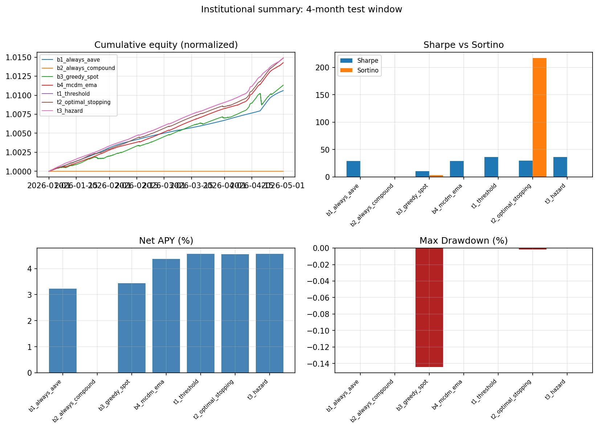

# Performance Dossier

Per-policy performance over the Jan – Apr 2026 test window ($1M
initial position, daily-aggregation Sharpe per Lo (2002) convention).

## Headline metrics

| Policy | Net APY | Sharpe | Sortino | Calmar | IR vs B1 | Max DD | DD dur (d) | TTR (d) | CVaR₉₅ | CVaR₉₉ |
|---|---:|---:|---:|---:|---:|---:|---:|---:|---:|---:|
| b1_always_aave | 3.23% | 29.34 | ∞ | ∞ | 0.00 | 0.000% | 0 | 0.0 | 0.005% | 0.004% |
| b2_always_compound | 0.00% | 0.00 | ∞ | ∞ | -29.34 | 0.000% | 0 | 0.0 | 0.000% | 0.000% |
| b3_greedy_spot | 3.44% | 10.68 | 3.25 | 24 | 0.59 | -0.144% | 7 | 6.0 | -0.030% | -0.079% |
| b4_mcdm_ema | 4.37% | 29.20 | ∞ | ∞ | 8.57 | 0.000% | 0 | 0.0 | 0.003% | 0.001% |
| t1_threshold | 4.56% | 36.09 | ∞ | ∞ | 9.94 | 0.000% | 0 | 0.0 | 0.006% | 0.003% |
| t2_optimal_stopping | 4.55% | 29.81 | 216.68 | 2968 | 9.66 | -0.002% | 2 | 1.0 | 0.001% | -0.001% |
| t3_hazard | 4.56% | 36.09 | ∞ | ∞ | 9.94 | 0.000% | 0 | 0.0 | 0.006% | 0.003% |

## Higher moments

| Policy | Skewness | Excess Kurtosis | Final equity (\$) |
|---|---:|---:|---:|
| b1_always_aave | 3.21 | 10.66 | 1,010,588 |
| b2_always_compound | — | — | 1,000,000 |
| b3_greedy_spot | -6.32 | 58.36 | 1,011,295 |
| b4_mcdm_ema | 2.51 | 7.07 | 1,014,247 |
| t1_threshold | 3.06 | 11.76 | 1,014,880 |
| t2_optimal_stopping | 2.15 | 5.84 | 1,014,844 |
| t3_hazard | 3.06 | 11.76 | 1,014,880 |

## Interpretation note (Sharpe magnitude)

Sharpe ratios on USDC supply strategies routinely measure 20-40
annualized — substantially higher than typical equity strategies
(Sharpe 0.5-2). This is **not** a methodology artifact but a property
of the asset class: USDC supply rates accrue continuously with
near-zero daily volatility (mean daily return ≈ 0.012% vs std ≈ 0.001%
for B1 Aave hold). The same is observed across major DeFi yield
trackers (DefiLlama, Yearn Vaults reports). For fund-side comparison,
the **Information Ratio vs Aave hold** is the more familiar metric:
T1 IR = 9.94 means the allocator generates 9.94 units of excess return
per unit of tracking-error vs the passive Aave hold benchmark.

## Notes

- Sharpe annualization at 365 (crypto markets do not close);
  daily returns from per-block equity per Lo (2002) convention.
- Sortino target = 0 (USDC numeraire, no risk-free distinction).
  Many policies show Sortino = ∞ because they had zero down-days in
  the test window (continuous positive APR accrual + perfectly-timed
  rebalances).
- IR computed only vs B1 always_aave (the natural passive benchmark).
- CVaR computed as the conditional mean of the α-worst daily returns.
  For continuously-positive series (B1, B4, T1, T3), CVaR is small but
  positive — this is the "5%-worst" of all-positive returns.

