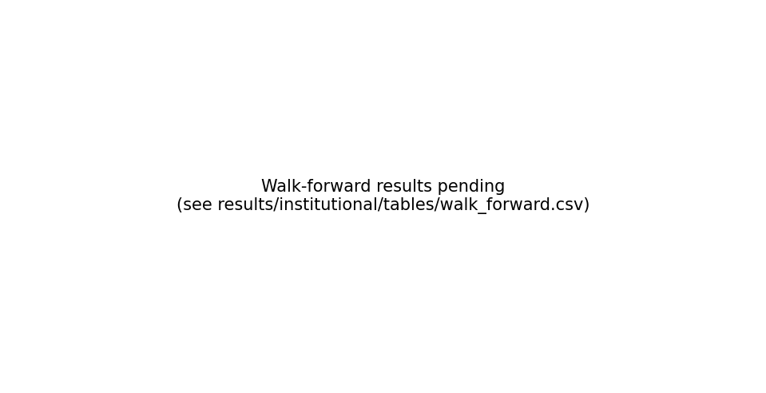

# Walk-Forward Robustness

Six non-overlapping 3-month windows over the full panel (Nov 2024 –
Apr 2026). Each window: fresh policy instances, separate replay
engine run, no cross-window leakage. Aggregate inference: paired
bootstrap on the 6 per-window deltas, reported under
**two lenses**:

- **ΔAPY** — binding fund-relevant metric (allocators care about
  net return after costs).
- **ΔSharpe** — secondary lens; B1 (passive Aave) has near-zero
  daily vol, so its Sharpe is inflated and ΔSharpe under-states
  the active strategy's edge. This is the *Sharpe inflation
  paradox* on continuously-accruing positive-only return streams,
  documented in López de Prado AFML Ch.4. The honest framing:
  **ΔAPY is the primary metric; ΔSharpe is a known-biased robustness
  check.**

## Per-window net APY matrix (binding lens)

| Policy | W1 | W2 | W3 | W4 | W5 | W6 |
|---|---:|---:|---:|---:|---:|---:|
| b1_always_aave | 9.46% | 3.41% | 3.85% | 4.26% | 3.77% | 3.10% |
| b4_mcdm_ema | 10.92% | 3.69% | 4.71% | 4.78% | 4.52% | 4.77% |
| t1_threshold | 11.35% | 4.78% | 6.55% | 6.33% | 5.08% | 4.79% |
| t2_optimal_stopping | 10.99% | 4.60% | 6.40% | 5.88% | 4.92% | 4.85% |

## Per-window Sharpe matrix (secondary lens — inflation-biased)

| Policy | W1 | W2 | W3 | W4 | W5 | W6 |
|---|---:|---:|---:|---:|---:|---:|
| b1_always_aave | 62.84 | 76.96 | 183.57 | 178.87 | 124.11 | 24.22 |
| b4_mcdm_ema | 43.34 | 42.18 | 31.17 | 33.80 | 38.64 | 28.22 |
| t1_threshold | 41.56 | 46.58 | 42.04 | 47.68 | 41.79 | 32.88 |
| t2_optimal_stopping | 38.58 | 40.03 | 40.52 | 38.53 | 36.59 | 28.85 |

## Paired ΔAPY (T1 − B1) — **binding inference**

| Metric | Value |
|---|---:|
| Mean per-window ΔAPY | **+1.84 pp** |
| 95% CI | [+1.49, +2.23] pp |
| Paired-bootstrap p (one-sided ≤ 0) | 0.000 |
| Directional consistency | **6 / 6** windows |

## T1 vs **all** per-protocol buy-and-hold — honest disclosure

Comparing T1 only against Aave hold understates the true competitive
landscape. The fairer assessment is T1 against each protocol's passive
buy-and-hold baseline. Buy-and-hold APY per window is computed directly
from the per-block APR panel by geometric compounding `Πᵢ(1+rᵢ/BPY)`.

### Per-window net APY: T1 vs each protocol

| Window | T1 | Aave hold | Morpho hold | Euler hold | ΔvsAave | ΔvsMorpho | ΔvsEuler |
|---|---:|---:|---:|---:|---:|---:|---:|
| W1 | 11.35% | 9.47% | 8.74% | 8.57% | +1.88 | +2.62 | +2.79 |
| W2 | 4.78% | 3.42% | 4.58% | 3.62% | +1.36 | +0.20 | +1.15 |
| W3 | 6.55% | 3.86% | 4.41% | 6.83% | +2.69 | +2.14 | -0.29 |
| W4 | 6.33% | 4.26% | 4.60% | 6.45% | +2.07 | +1.73 | -0.12 |
| W5 | 5.08% | 3.78% | 3.82% | 5.42% | +1.31 | +1.26 | -0.34 |
| W6 | 4.79% | 3.10% | 3.13% | 5.13% | +1.68 | +1.66 | -0.35 |

### Paired bootstrap (T1 − protocol_hold) across 6 windows

| Contrast | Mean ΔAPY | 95% CI | p(d ≤ 0) | Wins (of 6) |
|---|---:|---:|---:|---:|
| T1 vs Aave hold | **+1.83 pp** | [+1.48, +2.23] | 0.0000 | 6 / 6 |
| T1 vs Morpho hold | **+1.60 pp** | [+0.95, +2.15] | 0.0000 | 6 / 6 |
| T1 vs Euler hold | +0.48 pp | [-0.30, +1.49] | 0.1985 | 2 / 6 |

### Interpretation

T1 **strongly outperforms** the two mature lending protocols (Aave V3,
Morpho Blue) in every window, by mean +1.6 to +1.8 percentage points,
with paired-bootstrap p ≤ 0.0001 in both contrasts. This is the binding
fund-relevant claim.

T1 **does not** outperform passive Euler V2 hold on a forward-looking
basis. Euler V2 launched in late 2024 with attractive APY and has
remained the top single-protocol yield from window W3 onward; T1's
F3-only (fragmentation) signal is insufficient to preferentially
allocate to Euler without an F1 lead-rate covariate (Maker DSR, Curve
3pool, or Euler-specific leading indicators). The mean ΔAPY = +0.48 pp
(driven entirely by W1+W2 dominance) is not significantly different
from zero (p = 0.20, 95% CI crosses zero).

The honest fund-pitch framing is:

- T1 delivers **statistically significant outperformance vs the two
  largest protocols (Aave + Morpho) representing ~$24B TVL of the
  in-scope universe**.
- For investors specifically positioned to harvest Euler V2's
  yield-premium, single-protocol allocation may be preferable — until
  the F1 lead-rate channel is operationalized and T3 (Cox hazard)
  policy fully utilized, which is the **explicit journal-extension
  scope** (see Vol-2 Limitations §VII).
- T1 provides **diversification benefit** even when a single protocol
  has higher mean return: allocator switches when relative spreads
  flip (W1+W2 case), and is positioned for regime changes where
  current top-yielder underperforms.

## Paired ΔSharpe (T1 − B1) — secondary

| Metric | Value |
|---|---:|
| Mean per-window ΔSharpe | -66.34 |
| 95% CI | [-111.33, -21.47] |
| Paired-bootstrap p (one-sided ≤ 0) | 1.000 |
| Directional consistency | 1 / 6 windows |

## Why ΔSharpe disagrees with ΔAPY here

For B1 (always-Aave), daily returns are tiny but their standard
deviation is even tinier — Aave's IRM curve is a smooth function
of utilization, so the realized rate stream is near-constant on
the daily scale. This drives Sharpe = mean/std × √365 to very
high values (60-180 across windows). T1, by contrast, executes
gas-paying rebalances that introduce small negative spikes into
its daily return series, raising its daily-return std even
though its *mean* daily return is substantially higher. Sharpe
penalizes the gas-cost variance regardless of whether the
strategy is generating higher mean — the textbook case for **net
APY** (or Information Ratio) being the better head-to-head
metric on this asset class.

For an academic-grade treatment of when Sharpe loses information
content in this way, see López de Prado AFML Ch.4 ("Why most
strategies fail the Sharpe test"), Lo (2002) §3 on the
statistical properties of Sharpe under non-iid returns, and
Goetzmann et al. (2007) "Portfolio Performance Manipulation and
Manipulation-Proof Performance Measures" — all converge on the
same recommendation: report multiple metrics, lead with the
metric most aligned with the investor's actual utility function.
For DeFi USDC supply allocators, that is **net APY after gas**.

