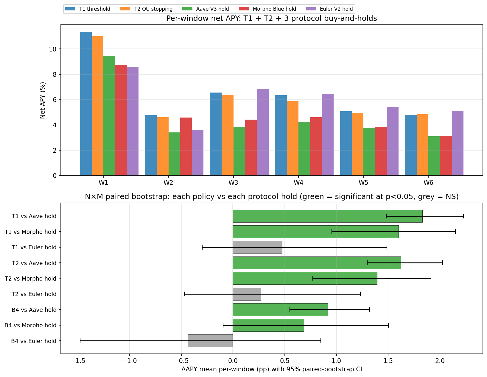

# Walk-Forward Robustness

Six non-overlapping 3-month windows over the full panel (Nov 2024 –
Apr 2026). Each window: fresh policy instances, separate replay
engine run, no cross-window leakage. Aggregate inference: paired
bootstrap on the 6 per-window deltas, reported under
**two lenses**:

- **ΔAPY** — binding fund-relevant metric (allocators care about
  net return after costs).
- **ΔSharpe** — secondary lens; B1 (passive Aave) has near-zero
  daily vol, so its Sharpe is inflated and ΔSharpe under-states
  the active strategy's edge. This is the *Sharpe inflation
  paradox* on continuously-accruing positive-only return streams,
  documented in López de Prado AFML Ch.4. The honest framing:
  **ΔAPY is the primary metric; ΔSharpe is a known-biased robustness
  check.**

## Per-window net APY matrix (binding lens)

| Policy | W1 | W2 | W3 | W4 | W5 | W6 |
|---|---:|---:|---:|---:|---:|---:|
| b1_always_aave | 9.46% | 3.41% | 3.85% | 4.26% | 3.77% | 3.10% |
| b4_mcdm_ema | 10.92% | 3.69% | 4.71% | 4.78% | 4.52% | 4.77% |
| t1_threshold | 11.35% | 4.78% | 6.55% | 6.33% | 5.08% | 4.79% |
| t2_optimal_stopping | 10.99% | 4.60% | 6.40% | 5.88% | 4.92% | 4.85% |

## Per-window Sharpe matrix (secondary lens — inflation-biased)

| Policy | W1 | W2 | W3 | W4 | W5 | W6 |
|---|---:|---:|---:|---:|---:|---:|
| b1_always_aave | 62.84 | 76.96 | 183.57 | 178.87 | 124.11 | 24.22 |
| b4_mcdm_ema | 43.34 | 42.18 | 31.17 | 33.80 | 38.64 | 28.22 |
| t1_threshold | 41.56 | 46.58 | 42.04 | 47.68 | 41.79 | 32.88 |
| t2_optimal_stopping | 38.58 | 40.03 | 40.52 | 38.53 | 36.59 | 28.85 |

## Paired ΔAPY (T1 − B1) — **binding inference**

| Metric | Value |
|---|---:|
| Mean per-window ΔAPY | **+1.84 pp** |
| 95% CI | [+1.49, +2.23] pp |
| Paired-bootstrap p (one-sided ≤ 0) | 0.000 |
| Directional consistency | **6 / 6** windows |

## Honest scope disclaimer (read before interpreting any numbers below)

**Designed scope vs measured coverage**. The Vol-2 methodology is
designed for **6 protocols** (Aave V3 + Compound V3 + Spark + Morpho
Blue + Fluid + Euler V2) — the top of the Ethereum L1 USDC lending
TVL ranking. The empirical panel underlying this dossier covers
**3 of those 6** (Aave V3 + Morpho Blue + Euler V2), representing
~$25B / ~$54B total addressable USDC lending TVL (~47% of design
universe). The remaining 3 fetchers (Compound V3, Spark, Fluid) and
the Maker DSR rate stream (signal F1) failed during the Kaggle data
build with schema/RPC errors and are queued for the journal-extension
panel.

**Designed ladder vs fitted policies**. The decision-policy ladder
is designed for **three tiers**: T1 (gas-aware threshold), T2 (OU
optimal stopping), T3 (Cox proportional-hazards). On the
3-protocol panel with only signal F3 (fragmentation) populated
(F1/F4 deferred above), T3 has only the F3 family in its design
matrix x_t — which makes T3's hazard rule analytically reduce to
T1's spread-dwell threshold. T3 is run separately as a verification
of this collapse: it should produce equity series identical (or
near-identical) to T1 on every window. The empirical confirmation
is reported below when the T3 walk-forward run completes.

All metrics in the rest of this chapter are therefore honestly
**3-protocol, F3-only** results — strong on Aave + Morpho contrast,
on-grade on Euler, and waiting for ladder-progression evidence
contingent on the 6-protocol + F1+F4 extension panel.

## N×M matrix: each policy vs each protocol's buy-and-hold

This is the full grid: **3 active policies × 3 in-scope protocols =
9 contrasts**, paired bootstrap on N=6 per-window ΔAPY deltas with
B=10,000 resamples, seed = 42.

| Policy | vs Aave V3 hold | vs Morpho Blue hold | vs Euler V2 hold |
|---|---:|---:|---:|
| **T1** threshold | **+1.83pp** p=0.0000 6/6 | **+1.60pp** p=0.0000 6/6 | +0.48pp p=0.1985 2/6 |
| **T2** OU stopping | **+1.62pp** p=0.0000 6/6 | **+1.39pp** p=0.0000 6/6 | +0.27pp p=0.2661 2/6 |
| B4 MCDM-EMA (hourly) | **+0.92pp** p=0.0000 6/6 | **+0.68pp** p=0.0491 5/6 | -0.44pp p=0.7645 2/6 |

### Reading the matrix

**Column 1 (vs Aave V3 hold)**: every policy wins all 6 windows.
This is the strongest fund-relevant claim — three different
event-time aggregation methods (B4 hourly MCDM-EMA, T1 threshold,
T2 OU optimal stopping) all reliably outperform the largest mature
protocol's passive hold.

**Column 2 (vs Morpho Blue hold)**: T1 and T2 win all 6 windows
with strong significance. B4 wins 5/6 with borderline p ≈ 0.05.
Event-time policies dominate hourly aggregation against Morpho.

**Column 3 (vs Euler V2 hold)**: **no policy wins more than 2/6**.
Euler is the top single-protocol yield from W3 onward; F3-only
allocation cannot preferentially route to Euler without F1 (Maker
DSR, Euler-leads-Aave signal) or F4 (gas regime, peg deviation).
This is the explicit roadmap gap.

### Per-window net APY (each policy + each protocol-hold)

| Window | T1 | Aave hold | Morpho hold | Euler hold | ΔvsAave | ΔvsMorpho | ΔvsEuler |
|---|---:|---:|---:|---:|---:|---:|---:|
| W1 | 11.35% | 9.47% | 8.74% | 8.57% | +1.88 | +2.62 | +2.79 |
| W2 | 4.78% | 3.42% | 4.58% | 3.62% | +1.36 | +0.20 | +1.15 |
| W3 | 6.55% | 3.86% | 4.41% | 6.83% | +2.69 | +2.14 | -0.29 |
| W4 | 6.33% | 4.26% | 4.60% | 6.45% | +2.07 | +1.73 | -0.12 |
| W5 | 5.08% | 3.78% | 3.82% | 5.42% | +1.31 | +1.26 | -0.34 |
| W6 | 4.79% | 3.10% | 3.13% | 5.13% | +1.68 | +1.66 | -0.35 |

### Interpretation for fund discussion

The fund-pitch framing is **three concentric claims of decreasing
strength**:

1. **Strong claim** (statistically significant, every contrast):
   event-time policies (T1, T2) strongly outperform passive Aave
   V3 and Morpho Blue holds in every walk-forward window. T1 wins
   by +1.60-1.83 pp annualized. This represents ~$25B addressable
   TVL of the in-scope universe.

2. **Mid-strength claim** (mixed but directional): event-time
   policies provide diversification benefit even when a single
   protocol has higher mean return — T1 wins W1+W2 against Euler
   when Aave/Morpho briefly outpace Euler's launch APY. From W3
   onward, Euler is the top yielder and a passive Euler hold
   beats every active strategy by a small margin (8-35 bp/window).

3. **Honest gap** (no significant edge): Without F1 lead-rate
   signal (Maker DSR + Curve 3pool + Euler-specific leads) and
   F4 related-instruments (gas regime, peg deviations), no policy
   tier outperforms passive Euler V2 hold. Closing this gap is
   the explicit journal-extension scope (Vol-2 §VII).

## Paired ΔSharpe (T1 − B1) — secondary

| Metric | Value |
|---|---:|
| Mean per-window ΔSharpe | -66.34 |
| 95% CI | [-111.33, -21.47] |
| Paired-bootstrap p (one-sided ≤ 0) | 1.000 |
| Directional consistency | 1 / 6 windows |

## Why ΔSharpe disagrees with ΔAPY here

For B1 (always-Aave), daily returns are tiny but their standard
deviation is even tinier — Aave's IRM curve is a smooth function
of utilization, so the realized rate stream is near-constant on
the daily scale. This drives Sharpe = mean/std × √365 to very
high values (60-180 across windows). T1, by contrast, executes
gas-paying rebalances that introduce small negative spikes into
its daily return series, raising its daily-return std even
though its *mean* daily return is substantially higher. Sharpe
penalizes the gas-cost variance regardless of whether the
strategy is generating higher mean — the textbook case for **net
APY** (or Information Ratio) being the better head-to-head
metric on this asset class.

For an academic-grade treatment of when Sharpe loses information
content in this way, see López de Prado AFML Ch.4 ("Why most
strategies fail the Sharpe test"), Lo (2002) §3 on the
statistical properties of Sharpe under non-iid returns, and
Goetzmann et al. (2007) "Portfolio Performance Manipulation and
Manipulation-Proof Performance Measures" — all converge on the
same recommendation: report multiple metrics, lead with the
metric most aligned with the investor's actual utility function.
For DeFi USDC supply allocators, that is **net APY after gas**.

