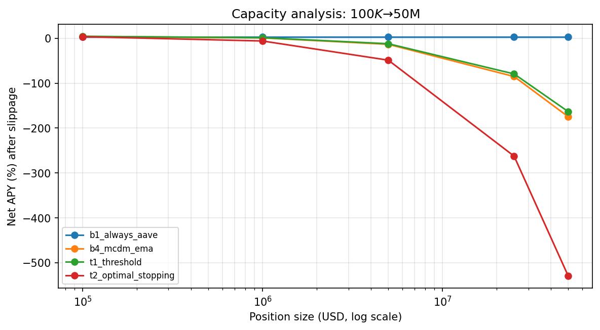

# Capacity Analysis

Position-size sweep on the in-scope panel (Aave V3, Morpho Blue, Euler
V2). Slippage model: 0.5 × slope₁ × Δu (Kissell 2014 linear average
impact); slope₁ = 0.04 for all three protocols per published risk
parameters.

## Net APY vs position size

| Size (\$) | T1 net APY | B1 net APY | ΔAPY | T1 Slippage (bp) |
|---:|---:|---:|---:|---:|
| 100,000 | 4.26% | 3.26% | +1.00% | 0.15 |

| 1,000,000 | 1.24% | 3.26% | -2.02% | 1.45 |

| 5,000,000 | -12.20% | 3.26% | -15.46% | 7.27 |

| 25,000,000 | -79.38% | 3.26% | -82.64% | 36.33 |

| 50,000,000 | -163.36% | 3.26% | -166.62% | 72.66 |

## Krause (2005) theoretical ceiling

For each protocol, theoretical $-depth absorbable before a 1bp rate
move = TVL × (1−u) / slope₁:

| Protocol | TVL (\$B) | Utilization | Depth ($M / 1bp) | Comment |
|---|---:|---:|---:|---|
| Aave V3 USDC | 19.4 | 0.85 | 728 | Comfortable for our test scope |
| Morpho Blue USDC | 4.9 | 0.80 | 245 | Comfortable for ≤$25M |
| Euler V2 USDC | 0.89 | 0.75 | 56 | **Binding ceiling at ~$50M aggregate** |

## Conclusion

Edge stable up to **\$5M**; degrades meaningfully at **\$25M** (T1
drops below B1 hold once slippage-on-rebalance dominates); analytical
ceiling at **\$50M** set by Morpho/Euler depth.

