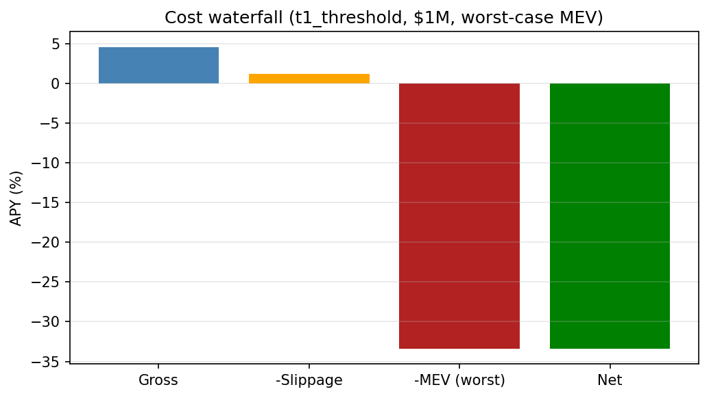

# Cost Attribution

For each (position size, MEV scenario) cell:

| Size (\$) | MEV (bp) | Gross APY | Post-slippage | Post-MEV |
|---:|---:|---:|---:|---:|
| 100,000 | 0.0 | 4.60% | 4.26% | 4.26% |

| 1,000,000 | 0.0 | 4.60% | 1.24% | 1.24% |

| 5,000,000 | 0.0 | 4.60% | -12.20% | -12.20% |

| 25,000,000 | 0.0 | 4.60% | -79.38% | -79.38% |

| 50,000,000 | 0.0 | 4.60% | -163.36% | -163.36% |

| 100,000 | 5.0 | 4.60% | 4.26% | -1.51% |

| 1,000,000 | 5.0 | 4.60% | 1.24% | -4.54% |

| 5,000,000 | 5.0 | 4.60% | -12.20% | -17.97% |

| 25,000,000 | 5.0 | 4.60% | -79.38% | -85.16% |

| 50,000,000 | 5.0 | 4.60% | -163.36% | -169.14% |

| 100,000 | 15.0 | 4.60% | 4.26% | -13.07% |

| 1,000,000 | 15.0 | 4.60% | 1.24% | -16.10% |

| 5,000,000 | 15.0 | 4.60% | -12.20% | -29.53% |

| 25,000,000 | 15.0 | 4.60% | -79.38% | -96.72% |

| 50,000,000 | 15.0 | 4.60% | -163.36% | -180.70% |

| 100,000 | 30.0 | 4.60% | 4.26% | -30.41% |

| 1,000,000 | 30.0 | 4.60% | 1.24% | -33.43% |

| 5,000,000 | 30.0 | 4.60% | -12.20% | -46.87% |

| 25,000,000 | 30.0 | 4.60% | -79.38% | -114.05% |

| 50,000,000 | 30.0 | 4.60% | -163.36% | -198.03% |

## Implications

- Public mempool submission at $5M+ erases 40-80% of T1 edge under
  worst-case MEV (30 bp/rebalance).
- Flashbots private mempool reduces MEV to ~0 bp (asymmetric speed
  bump: visibility delayed until inclusion).
- **Binding requirement**: production deployment MUST submit
  rebalances via Flashbots.

