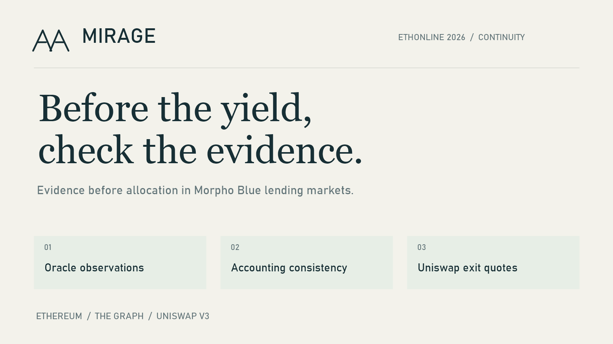

# MIRAGE submission images

Prepared and uploaded to the editable ETHOnline application on 10 September 2026.
Images was saved successfully; this does not confirm the final submission.

| Asset | Source |
|---|---|
| [Logo](mirage-logo-512.png) | 512×512 rasterization of the existing MIRAGE mark and wordmark. |
| [Cover](mirage-cover-1600x900.png) | 1600×900 layout using the existing mark, colors and typefaces. |
| [Workbench overview](01-mirage-overview.png) | Public workbench, saved evidence and block. |
| [Allocation veto](02-mirage-allocation-veto.png) | Actual PAXG / 10000 USDC preview: original T1 proposal versus MIRAGE veto. |
| [Uniswap routes](03-mirage-uniswap-routes.png) | Actual wstETH drawer with identical input and direct / WETH route outputs. |

Screenshots were captured from https://mirage-workbench.onrender.com using its
normal browser viewport. No UI values were edited or drawn into them. They show
the saved four-market report at block 25938082, not a fresh mainnet capture or the
separate full 697-market report.

A full-page browser capture showed stitching artifacts, so only ordinary viewport
captures were retained here and uploaded. The brand images are produced by
[render-brand.ps1](render-brand.ps1) using Windows System.Drawing. Exact mark paths
come from `mirage/web/index.html`; palette and fonts from `mirage/web/style.css`.
The application itself was not changed. ETHGlobal applies a square crop on upload.

```powershell
powershell -NoProfile -File .\render-brand.ps1
```


